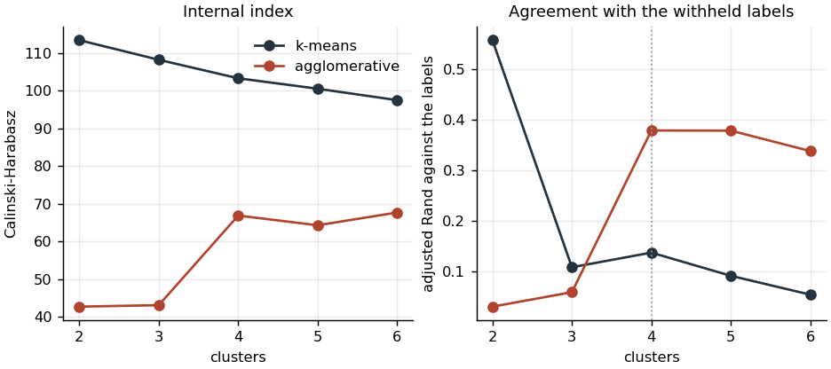

# Four machine learning methods on health data

Four trainings, one per method family, sharing one pipeline. Classification with
explanations, clustering, association rule mining and regression, each on a
public medical dataset, each with its own write-up in `docs/`.

The work was completed as coursework for DATA_SCI 8140, Advanced Methods in
Health Data Science, in **Fall 2025**. This repository rebuilds that work from
the original public dataset with the course scaffolding removed, so that the
methods and the reasoning behind them stand as a record in their own right.

| Method | Task | Data |
|---|---|---|
| [Supervised classification](docs/01-supervised-classification.md) | Readmission inside thirty days | Diabetes 130-US Hospitals, 101,766 encounters (Strack et al. 2014) |
| [Clustering](docs/02-clustering.md) | Recover hepatitis C categories unlabeled | HCV panel, 615 subjects (Lichtinghagen et al. 2020) |
| [Association rules](docs/03-association-rules.md) | Co-occurring diagnostic features | Wisconsin diagnostic breast cancer, 569 samples (Wolberg et al. 1995) |
| [Regression](docs/04-regression.md) | Daily alcohol intake from a liver enzyme panel | BUPA liver disorders, 345 subjects (Forsyth 1990) |

## 1. Supervised classification with explanations

A feed-forward network predicts readmission inside thirty days at the moment of
discharge. One hidden layer of 32 units was selected from eight configurations
by three-fold cross-validation drawn over patients. A network represents
interactions among the 43 features without any being specified in advance; it
returns no coefficient to read, it is beaten here by logistic regression on the
same features, and the class balancing it was given costs it discrimination. On 24,511
held-out encounters from 17,042 patients who appear nowhere in training it
reaches ROC-AUC 0.633 and average precision 0.189 against a readmission rate of
0.115, against 0.659 and 0.219 for logistic regression and 0.664 and 0.224 for
the same network trained on the natural class distribution. Oversampling the
minority class, applied correctly inside the training folds, still lowered
discrimination and calibration; all it bought was an operating point that
moving the threshold gives for free. Permutation importance puts the count of
prior inpatient visits first and the discharge destination second, with
everything else marginal.

Reproducing the ordering the coursework used, balancing the classes across the
whole cohort and splitting the balanced table by row, reports ROC-AUC 0.749 for
the same model. The difference of 0.117 is produced by 12,057 patients on
both sides of that boundary and 125,252 pairs of rows across it that agree in
every column.


## 2. Clustering

k-means, DBSCAN and agglomerative clustering with complete linkage partition ten
standardized laboratory assays for 582 subjects, with the diagnostic labels
withheld and used only to score the result. Clustering needs no labels and finds
structure nobody asked it for; it cannot be told which structure matters, and
the index chosen to compare methods decides the answer. At four clusters,
k-means leads on Calinski-Harabasz by a factor of two, 103.3 against 45.5 for
DBSCAN, and comes last on agreement with the withheld labels by a factor of
three, adjusted Rand 0.137 against 0.425. Two clusters separate cirrhosis from
every other category with an adjusted Rand of 0.906, placing 22 of the 24
cirrhosis cases in a cluster of 24, while hepatitis and fibrosis are not
recovered at any number of clusters.



## 3. Association rule mining

Apriori mines 92 items over 569 samples, each of the thirty image features
discretized into three levels, with the diagnosis present as two more items and
no distinguished target. Rule mining describes co-occurrence in the data it is
given and needs no labels; it says nothing about held-out precision, it returns
many rules that are restatements of one another, and its support threshold
silently decides which classes can appear at all. At the minimum support of 0.4
the coursework used, no itemset can contain the malignant diagnosis, because the
malignant rate is 0.373: every one of the 321 diagnosis rules describes the
benign class. The strongest reaches a lift of 1.588 against a ceiling of 1.594,
with 282 of the 283 samples in the lowest level of mean concave points, radius
error and worst perimeter being benign. The 19 items appearing in those rules
are all size and boundary shape measurements; texture, smoothness and symmetry
appear in none.


## 4. Regression

Least squares predicts self-reported half-pints of alcohol per day from five
blood tests for 341 male subjects. The method gives a coefficient with an
interval for every predictor and states plainly how little it explains; it
assumes a linear additive form and normal errors, and the residuals here are
skewed at 1.14 with Jarque-Bera p = 2.8 × 10⁻²⁵, so the intervals are narrower
than the true uncertainty. The five tests jointly relate to intake, F = 10.07 on
the training partition with p = 8.6 × 10⁻⁹, and explain little of it: R² is 0.216
on the 86 held-out subjects but 0.058 ± 0.093 under five-fold cross-validation,
and the second number is the one to quote. Mean corpuscular volume at 0.167
half-pints per released unit and gamma-glutamyl transpeptidase at 0.020 are the
two terms whose intervals exclude zero, and they are the two assays used
clinically to detect sustained drinking.

The seventh released column, `selector`, is excluded. The UCI record states that
it "has been widely misinterpreted in the past as a dependent variable
representing presence or absence of a liver disorder" when it is a train and
test split flag, and that the data holds no variable recording a liver disorder
at all. Gate 02 checks that the released file still carries it, that the cleaned
table does not, and that it is neither a predictor nor the target.


## The data

All four datasets are released under CC BY 4.0 by the UCI Machine Learning
Repository and are cited in full in [docs/references.md](docs/references.md).
None is redistributed here. `data/download_data.py` fetches the three that need
downloading and verifies each against the SHA-256 digest in `data/checksums.txt`;
the fourth ships inside scikit-learn. The course copies of the data were not
used, and for the readmission set the course copy is a preprocessed derivative
whose binning and encoding are undocumented, so every cleaning decision here was
re-derived from the original release.

## Reproducing it

```
python -m venv .venv
.venv/Scripts/python -m pip install -r requirements.txt
.venv/Scripts/python data/download_data.py
.venv/Scripts/python analysis/run_all.py
```

`analysis/run_all.py` runs the four analyses and draws every figure. Each
analysis writes its quantities into `results/metrics.csv` under its own prefix
and its tables into `results/`. Every figure is drawn from one of those tables
and computes nothing of its own, so a figure and the number quoted beside it
cannot disagree. The shared loading, splitting and evaluation code is in `src/`.
The grid search in model 1 dominates the runtime, taking 3,257 of the 3,282
seconds the recorded run took on a fourteen-core CPU; the other three analyses
finish in fifteen seconds between them.

## How it is checked

```
.venv/Scripts/python .checks/run_all_gates.py
.venv/Scripts/python .checks/inject_faults.py
```

Six gates guard the stages in order: environment, acquisition, schema,
preparation, modeling and reproducibility. Each exits non-zero on a failed check
and prints what it looked at. Gate 05 re-runs the whole pipeline into an empty
directory and compares every recorded quantity and every table against the
committed ones; `SKIP_RERUN=1` skips it and the summary says how many checks
were skipped. `inject_faults.py` breaks one thing at a time and confirms that
the gate guarding it fails, because a gate that has never failed is not
evidence.

## Citation

Taylor, P. *Four machine learning methods on health data.* 2026.
