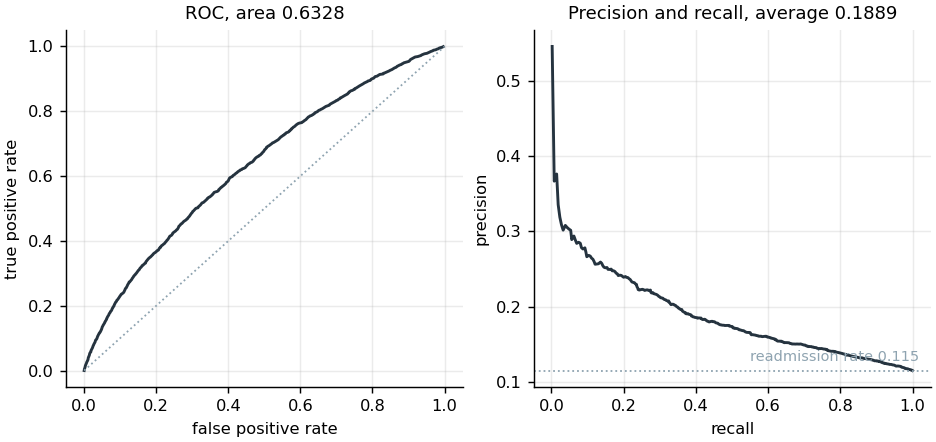
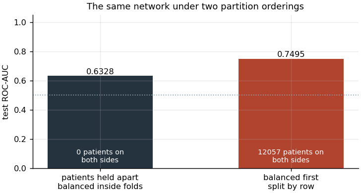
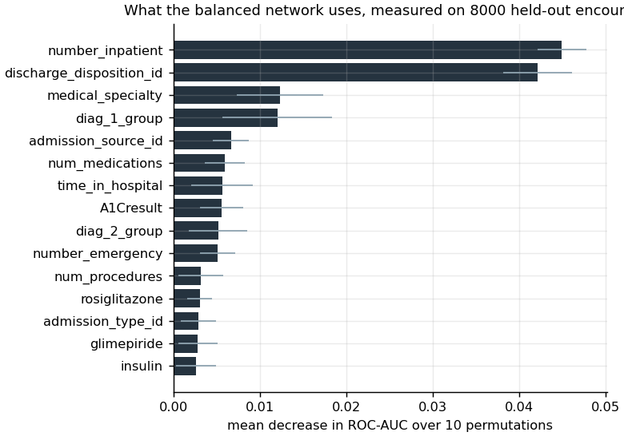

# Supervised classification: readmission inside thirty days

## The question

The Diabetes 130-US Hospitals data (Strack et al. 2014) records 101,766
inpatient encounters of diabetic patients at 130 hospitals over ten years. Each
encounter is labeled with whether the patient was readmitted inside thirty days,
after more than thirty days, or not at all. The question is whether readmission
inside thirty days can be predicted at the moment of discharge, and which
recorded facts carry the prediction.

The label is collapsed to two levels, readmission inside thirty days against
everything else, which is the outcome hospital readmission programs are measured
on. The prediction point is discharge, so every feature the model reads is a
fact available at that moment.

## Why the course copy of the data was not used

The coursework read a preprocessed derivative in which nine columns had already
been binned and label-encoded under a scheme that is documented only by a legend
in the assignment. That file records `age` as 0, 1 or 2 for three unequal
brackets, `diag_1` as nine integers, and `specialty` as six, with no record of
how the original 716 diagnosis codes or 72 department names were assigned. The
cleaning decisions are the substance of this stage, and a derivative hides them.

This rebuild reads the original release from UCI record 296 and re-derives every
step. The ICD-9 grouping follows the scheme Strack et al. published with the
data, and is in `src/data.icd9_group`.

## Preparation, and what each step removed

**Encounters whose outcome cannot be observed.** Six discharge dispositions
record death or a transfer to hospice: codes 11, 19, 20 and 21 for expired and
13 and 14 for hospice. A patient discharged under any of them cannot be
readmitted, so the encounter contributes a guaranteed negative that a model can
predict from the disposition alone. 2,423 encounters were removed on this rule.
This is the leakage the outcome definition creates, and removing it is why the
disposition can be kept as a predictor for the remaining encounters.

**Columns absent in most rows.** `weight` is absent in 96.85 percent of
encounters and is dropped. `payer_code` is the administrative identifier of the
paying insurer, absent in 39.66 percent, and carries no clinical measurement; it
is dropped as well.

**Columns with one value.** `examide` and `citoglipton` each take a single value
in every encounter and can carry no information. Both are dropped.

**Absence that is a decision and not a gap.** `A1Cresult` and `max_glu_serum`
are absent where the test was not ordered. Whether a clinician ordered a
glycated hemoglobin test is itself a recorded fact about the encounter, so the
absence becomes its own level, "not measured", and the rows are kept.

**The admitting department.** `medical_specialty` is recorded under 72 distinct
names and is not recorded at all in 48.94 percent of encounters. The 16 names
covering at least one percent of the recorded values are kept, the remainder are
collapsed into "other", and the absent value takes its own level.

**Coded categories.** The admission type, admission source and discharge
disposition are released as integer keys into a published lookup table. The
integers order nothing, so all three are carried as categories and one-hot
encoded, and are not left as numbers a model would read as a scale.

**Age.** The released bracket is a ten-year interval. Its midpoint is used,
which keeps the ordering that a one-hot encoding of the bracket would discard.

After 2,235 further encounters were removed for holding a missing value in a
retained column, 97,108 encounters from 68,166 patients remain, of which 11.46
percent record readmission inside thirty days. The model matrix holds 34
categorical and 9 numeric features.

## The partition is drawn over patients

101,766 encounters belong to 71,518 patients, so a patient contributes 1.42
encounters on average and many contribute several. A partition drawn over rows
places some of a patient's encounters in training and the rest in test, and the
model then predicts a patient it has already seen. The partition here is drawn
over patients with `GroupShuffleSplit`: 72,597 encounters from 51,124 patients
for training, 24,511 encounters from 17,042 patients for test, no patient and no
identical row on both sides. The draw is not stratified, so the two readmission
rates are a property of it and are recorded: 0.11433 in training and 0.11529 in
test.

## Class balance, corrected where it can be corrected

The outcome occurs in one encounter in nine. The coursework corrected that by
oversampling the minority class to parity, and this rebuild keeps the
correction, because the question worth answering is where it should be applied
and not whether the coursework should have used it.

Where it is applied is the whole point. The oversampling runs inside each
cross-validation training fold and on the training partition, and touches no
data a result is read from. The training partition of 72,597 encounters becomes
128,594. The test partition is untouched and keeps its natural rate of 0.115.

Whether it helps is a separate question, and it is measured below and not
assumed.

## The grid search

The exercise this rebuilds required the number of hidden layers to be one of the
searched parameters, and that requirement is kept. Eight configurations were
scored by three-fold cross-validation over patients inside the training
partition.

| Hidden layers | Widths | alpha | Cross-validated ROC-AUC |
|---|---|---|---|
| 1 | 32 | 0.0001 | 0.6163 |
| 1 | 32 | 0.01 | 0.6118 |
| 2 | 32-32 | 0.01 | 0.6003 |
| 3 | 32-32-32 | 0.0001 | 0.5943 |
| 3 | 32-32-32 | 0.01 | 0.5887 |
| 2 | 32-32 | 0.0001 | 0.5865 |
| 2 | 64-64 | 0.01 | 0.5830 |
| 2 | 64-64 | 0.0001 | 0.5806 |

Depth costs discrimination on this problem. The single hidden layer of 32 units is
best at 0.6163 with a fold-to-fold standard deviation of 0.0059, and the widest
network searched is worst at 0.5806. The gap between best and worst, 0.036, is
six times the fold-to-fold spread, so the ordering is not noise. With 34
categorical features one-hot encoded and a signal this weak, the extra capacity
fits the training folds and does not transfer.

The decision threshold was set to 0.427, the value maximizing Youden's J on the
out-of-fold training scores of the winning configuration. It was not chosen on
the test partition, and the same value is applied to the other two models
below.

## Result

Three models were scored on the same 24,511 held-out encounters, at the same
threshold of 0.427. The first is the selected network refitted on the balanced
training partition. The second is the identical architecture fitted on the
training partition with no oversampling at all. The third is logistic regression
on the same features and the same balanced partition.

| | Network, balanced | Network, unbalanced | Logistic regression |
|---|---|---|---|
| ROC-AUC | 0.6328 | **0.6635** | 0.6591 |
| Average precision | 0.1889 | **0.2236** | 0.2192 |
| Brier score | 0.2142 | **0.0975** | 0.2274 |
| Accuracy | 0.5986 | 0.8843 | 0.5019 |
| Balanced accuracy | 0.5928 | 0.5078 | 0.6045 |
| Precision | 0.1603 | 0.4602 | 0.1538 |
| Recall | 0.5853 | 0.0184 | 0.7378 |
| F1 | 0.2516 | 0.0354 | 0.2546 |

The oversampling costs discrimination. The same architecture trained on the
natural class distribution ranks the held-out encounters better on both
threshold-free measures, 0.6635 against 0.6328 on ROC-AUC and 0.2236 against
0.1889 on average precision, and its probabilities are far better calibrated,
with a Brier score of 0.0975 against 0.2142. Duplicating 56,000 minority rows
adds no information and shifts the loss the network minimizes away from the
distribution it is scored on.

What the oversampling does buy is an operating point. At the fixed threshold of
0.427 the unbalanced network predicts readmission for 113 of 24,511 encounters
and recovers 52 of the 2,826 readmissions, a recall of 0.018. The balanced
network recovers 1,654 of them. That difference is a property of where the two
models put their scores and not of how well they rank, and it could be obtained
from the unbalanced model by lowering its threshold instead. Resampling was the
wrong instrument for the job, and the measurement above is what says so.

Logistic regression beats the balanced network on ROC-AUC by 0.026 and on
average precision by 0.030, and sits just below the unbalanced network on both.
Three model configurations of very different capacity land inside 0.031 of each
other, which is what a limit in the data looks like.

Average precision is the number to read on this outcome. The readmission rate in
the test partition is 0.115, so average precision of 0.224 raises the expected
precision of a ranked list to about 1.9 times the base rate. ROC-AUC reads
better than that because it is insensitive to how rare the outcome is.

The headline network is reported as the balanced fit because the grid search
that selected its architecture was itself run under balancing, and quoting a
configuration chosen under one training regime while reporting it under another
would misstate how it was selected. A grid searched without balancing might
select a different architecture, and it was not run.

Accuracy is 0.599 against a majority-class rate of 0.885, so the model is less
accurate than always predicting no readmission. That is a consequence of the
threshold, which was set to trade precision for recall: at 0.427 the model
recovers 1,654 of the 2,826 readmissions in the test partition and raises 8,667
false alarms to do it.

| | Predicted not readmitted | Predicted readmitted |
|---|---|---|
| **Not readmitted** | 13,018 | 8,667 |
| **Readmitted** | 1,172 | 1,654 |

The rows of that matrix are the balanced network. A screening tool that flags 42
percent of discharges to catch 59 percent of the readmissions is not usable as
it stands. Whether it is worth deploying depends
on the cost of the intervention it triggers against the cost of a readmission,
and the model provides the ranking, not that judgment.

## The ordering defect, measured

The coursework balanced the classes across the whole cohort and split the
balanced table afterwards, by row. The identical architecture was fitted under
that ordering and scored on the partition that ordering produces.

| Ordering | Test ROC-AUC | Test accuracy | Patients on both sides |
|---|---|---|---|
| Patients held apart, balance inside training folds | 0.6328 | 0.5986 | 0 |
| Balanced first, split by row | 0.7495 | 0.6843 | 12,057 |

The defect adds 0.117 to the reported area. Two mechanisms produce it together
and this comparison does not separate them. Oversampling before the split
duplicates minority-class encounters, and 125,252 pairs of rows, one from each
side, agree in every column, so the model is scored partly on rows it
memorized. Splitting by row, and not by patient, additionally places 12,057
patients on both sides. The accuracy figures are not comparable at all: the
second partition is balanced, so its majority rate is 0.501 and not 0.885.

The reported figure of 0.7495 is not a worse model. It is the same model, and it
would fall back toward 0.63 on any new patient.

## What the model uses

Permutation importance was measured on the balanced network, over 8,000
held-out encounters with 10 permutations of each feature, as the mean fall in
ROC-AUC.

| Feature | Mean decrease in ROC-AUC | Standard deviation |
|---|---|---|
| number_inpatient | 0.0450 | 0.0028 |
| discharge_disposition_id | 0.0422 | 0.0040 |
| medical_specialty | 0.0123 | 0.0050 |
| diag_1_group | 0.0121 | 0.0064 |
| admission_source_id | 0.0067 | 0.0021 |
| num_medications | 0.0060 | 0.0023 |

Two features carry the model and everything else is marginal. The count of the
patient's prior inpatient visits in the preceding year is first, and it is also
the strongest single feature in the leakage audit, separating the classes alone
with an area of 0.607. Where the patient was discharged to is second. Both are
facts about the trajectory of care and not about the diabetes: how often this
patient has been admitted before, and whether they went home. The clinical
detail the dataset was assembled around, the glycated hemoglobin result, ranks
eighth at 0.0056.

Permutation importance describes what the fitted model uses and not what the
outcome depends on. Two correlated features can share their importance and both
appear unimportant. `number_inpatient`, `number_emergency` and
`number_outpatient` are three correlated counts of prior utilization, so the
0.0450 attributed to the first understates what prior utilization contributes
jointly.

## Limitations

The ceiling is low and it is a property of the problem. Three configurations of
very different capacity, fitted on the same features, span 0.031 of ROC-AUC. The
recorded facts do not determine readmission, which turns on discharge planning,
social support, medication adherence and access to follow-up care, none of which
are in this data.

The hyperparameter grid was searched with the classes balanced inside each fold,
and the measurement above shows that balancing lowers held-out discrimination.
The selected architecture is therefore the best of eight under a training regime
that is not the best regime, and the search was not repeated without it.

Every model here was compared against one held-out partition drawn at one seed.
The fold-to-fold standard deviation inside the grid search is 0.006, which gives
the scale of the sampling variation on a comparison of two configurations, but
the network and logistic regression were not compared across repeated
partitions.

The label is readmission to any of the 130 hospitals in the network. A patient
readmitted elsewhere is recorded as not readmitted, so the outcome rate is a
lower bound and the false positives above include an unknown number of true
readmissions the data cannot see.

The 2,235 encounters removed as incomplete were removed under a complete-case
rule, which assumes the missingness does not depend on the outcome. The
assumption was not tested.

The admitting department is not recorded for 48.94 percent of encounters, and
"not recorded" is carried as a level. If departments differ systematically in
their documentation, that level is partly a proxy for the hospital and not for
the specialty.

The data covers 1999 to 2008. Readmission rates, discharge practice and the
coding of diabetes medications have all moved since, so nothing here should be
read as a current estimate.

Explainability is limited to permutation importance. SHAP values, which the
coursework also produced, are not computed here, so the direction of each
feature's contribution and its behavior for an individual patient are not
reported.
