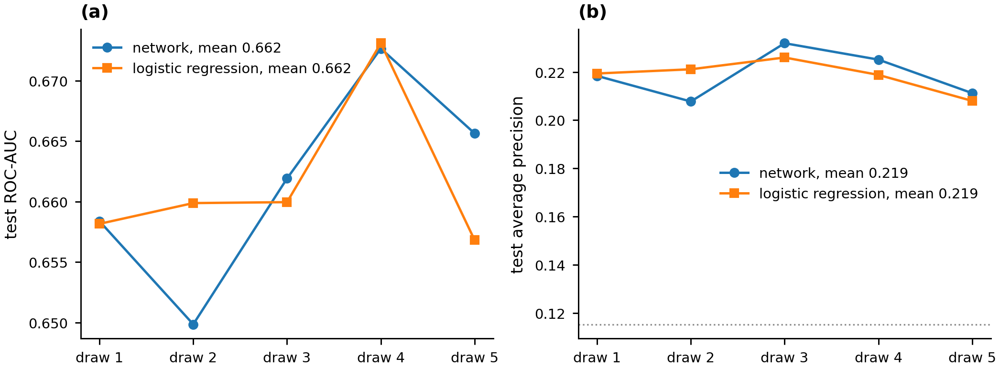

# Supervised classification: readmission inside thirty days

## The question

The Diabetes 130-US Hospitals data (Strack et al. 2014) records 101,766
inpatient encounters of diabetic patients at 130 hospitals between 1999 and
2008. Each encounter carries whether the patient was readmitted inside thirty
days, after more than thirty days, or not at all. This analysis predicts
readmission inside thirty days from the facts recorded at discharge and
measures which of those facts carry the prediction.

The label is collapsed to two levels, readmission inside thirty days against
everything else, because thirty days is the window hospital readmission
programs are measured on. The prediction point is discharge, so every feature
the model reads is a fact available at that moment.

The coursework asked for a feed-forward network with the number of hidden
layers among the searched hyperparameters, and that is the model reported.
Logistic regression on the same features is fitted beside it. A network that
cannot beat a linear model on the same inputs has not shown that it uses its
extra capacity, and fitting the linear model is the only way to find out.

## Why the course copy of the data was not used

The coursework read a preprocessed derivative in which nine columns had already
been binned and label-encoded under a scheme documented only by a legend in
the assignment. That file records `age` as 0, 1 or 2 for three unequal
brackets, `diag_1` as nine integers, and `specialty` as six, with no record of
how the original 716 diagnosis codes or 72 department names were assigned. The
cleaning decisions are the substance of this stage, and a derivative hides
them.

This rebuild reads the original release from UCI record 296, committed
unmodified under `data/raw/`, and re-derives every step. The ICD-9 grouping
follows the scheme Strack et al. published with the data and is in
`src/data.icd9_group`. The cleaned cohort and the partition are written to
`data/processed/`, so the rows behind every number below can be read directly.

## Preparation, and what each step removed

**Encounters whose outcome cannot be observed.** Six discharge dispositions
record death or a transfer to hospice: codes 11, 19, 20 and 21 for expired and
13 and 14 for hospice. A patient discharged under any of them cannot be
readmitted, so the encounter contributes a guaranteed negative that a model
could predict from the disposition alone. 2,423 encounters were removed on
this rule. Removing them is what makes the disposition safe to keep as a
predictor for the remaining encounters.

**Columns absent in most rows.** `weight` is absent in 96.85 percent of
encounters and is dropped. `payer_code` is the administrative identifier of the
paying insurer, absent in 39.66 percent, and carries no clinical measurement;
it is dropped as well.

**Columns with one value.** `examide` and `citoglipton` each take a single
value in every encounter and can carry no information. Both are dropped.

**Absence that is a decision.** `A1Cresult` and `max_glu_serum` are absent
where the test was not ordered. Whether a clinician ordered a glycated
hemoglobin test is itself a recorded fact about the encounter, so the absence
becomes its own level, "not measured", and the rows are kept.

**The admitting department.** `medical_specialty` is recorded under 72
distinct names and is absent in 48.94 percent of encounters. The 16 names
covering at least one percent of the recorded values are kept, the remainder
are collapsed into "other", and the absent value takes its own level.

**Coded categories.** The admission type, admission source and discharge
disposition are released as integer keys into a published lookup table. The
integers order nothing, so all three are carried as categories and one-hot
encoded.

**Age.** The released bracket is a ten-year interval. Its midpoint is used,
which keeps the ordering a one-hot encoding of the bracket would discard.

After 2,235 further encounters were removed for holding a missing value in a
retained column, 97,108 encounters from 68,166 patients remain, of which 11.46
percent record readmission inside thirty days. The model matrix holds 34
categorical and 9 numeric features.

## The partition is drawn over patients

The 101,766 released encounters belong to 71,518 patients, so a patient
contributes 1.42 encounters on average and many contribute several. A
partition drawn over rows places some of a patient's encounters in training
and the rest in test, and the model is then scored on a patient it has already
seen. The partition here is drawn over patients with `GroupShuffleSplit`. It
holds 72,597 encounters from 51,124 patients for training and 24,511
encounters from 17,042 patients for test, with no patient and no identical
row on both sides. The draw is not stratified, so the two readmission rates
are a property of it and are recorded: 0.11433 in training and 0.11529 in
test.

## Class balance as a searched regime

The outcome occurs in one encounter in nine. The coursework corrected that by
oversampling the minority class to parity before training. The correction is
routine in applied work and is rarely tested, so here it is treated as a
hyperparameter with two levels. Under the balanced regime the minority class
is oversampled to parity inside each cross-validation training fold, and on
the training partition for the final fit; the oversampling touches no data a
result is read from. Under the unbalanced regime the network trains on the
natural distribution. The same folds, drawn over patients, are used under
both, so a difference between the regimes is a difference between regimes and
not between draws.

The grid is searched once under each regime and the headline is the best
cross-validated score across both. The gate that guards this stage checks
that both regimes were searched and does not assert which should win.

## The grid search

The exercise required the number of hidden layers to be one of the searched
parameters, and that requirement is kept. Eight architectures were scored
under each regime by three-fold cross-validation over patients inside the
training partition, sixteen configurations in all.

| Training | Hidden layers | Widths | alpha | Cross-validated ROC-AUC | Mean iterations |
|---|---|---|---|---|---|
| unbalanced | 3 | 32-32-32 | 0.01 | **0.6582 ± 0.0069** | 17 |
| unbalanced | 1 | 32 | 0.01 | 0.6571 ± 0.0127 | 20 |
| unbalanced | 2 | 64-64 | 0.01 | 0.6566 ± 0.0019 | 18 |
| unbalanced | 1 | 32 | 0.0001 | 0.6560 ± 0.0119 | 19 |
| unbalanced | 2 | 64-64 | 0.0001 | 0.6539 ± 0.0049 | 18 |
| unbalanced | 3 | 32-32-32 | 0.0001 | 0.6539 ± 0.0098 | 22 |
| unbalanced | 2 | 32-32 | 0.01 | 0.6538 ± 0.0088 | 13 |
| unbalanced | 2 | 32-32 | 0.0001 | 0.6531 ± 0.0087 | 13 |
| balanced | 1 | 32 | 0.0001 | 0.6163 ± 0.0059 | 91 |
| balanced | 1 | 32 | 0.01 | 0.6118 ± 0.0042 | 107 |
| balanced | 2 | 32-32 | 0.01 | 0.6003 ± 0.0164 | 101 |
| balanced | 3 | 32-32-32 | 0.0001 | 0.5943 ± 0.0051 | 94 |
| balanced | 3 | 32-32-32 | 0.01 | 0.5887 ± 0.0061 | 114 |
| balanced | 2 | 32-32 | 0.0001 | 0.5865 ± 0.0083 | 90 |
| balanced | 2 | 64-64 | 0.01 | 0.5830 ± 0.0014 | 155 |
| balanced | 2 | 64-64 | 0.0001 | 0.5806 ± 0.0055 | 99 |

The regime separates the table. Every unbalanced configuration scores above
every balanced one, and the worst unbalanced architecture beats the best
balanced one by 0.037. Inside the unbalanced block the eight architectures
span 0.005, which is inside the fold-to-fold standard deviation of most of
them, so once the regime is right the architecture makes almost no difference.
Inside the balanced block depth costs discrimination. The single layer of 32
units is best at 0.6163 and the widest network is worst at 0.5806, a gap of
0.036 that is six times the fold-to-fold spread.

The iteration counts give the mechanism. The training loop stops when a
held-out slice of the training fold stops improving. Under the balanced regime
that slice is itself balanced, so the loop keeps finding improvement on
duplicated minority rows and runs for 90 to 155 iterations. Under the
unbalanced regime the slice has the natural distribution, the one the model
will be scored on, and the loop stops after 13 to 22 iterations. Oversampling
gives the network more to memorize and nothing new to learn, and a deeper
network memorizes the duplicates more completely, which is why depth hurts
under one regime and is immaterial under the other.

The selected configuration is three hidden layers of 32 units at an alpha of
0.01 under the unbalanced regime. The single hidden layer at the same alpha
sits 0.001 behind it, well inside one standard deviation, so the depth of the
network is immaterial here and the regime is what the table establishes.

The decision threshold was set to 0.125, the value maximizing Youden's J on
the out-of-fold training scores of the selected configuration. On an outcome
with a base rate of 0.115, a threshold near the base rate is what a calibrated
model should produce. The threshold was not chosen on the test partition, and
the same value is applied to every model scored below.

## Result

Three models were scored on the same 24,511 held-out encounters at the same
threshold. The first is the selected network, refitted on the unbalanced
training partition. The second is the identical architecture refitted on the
balanced training partition, so the difference between the first two rows is
the regime alone. The third is logistic regression on the same features and
the same unbalanced partition.

| | Network, unbalanced, selected | Network, balanced | Logistic regression, unbalanced |
|---|---|---|---|
| ROC-AUC | 0.6584 | 0.5952 | 0.6582 |
| Average precision | 0.2184 | 0.1568 | 0.2194 |
| Brier score | 0.0978 | 0.2338 | 0.0978 |
| Accuracy | 0.6468 | 0.4385 | 0.7125 |
| Balanced accuracy | 0.6102 | 0.5623 | 0.6057 |
| Precision | 0.1764 | 0.1360 | 0.1923 |
| Recall | 0.5626 | 0.7233 | 0.4667 |
| F1 | 0.2686 | 0.2290 | 0.2724 |

The network and logistic regression differ by 0.0002 on ROC-AUC, by 0.001 on
average precision and by 0.00003 on Brier score. A network with three hidden
layers, reading 34 one-hot encoded categories and 9 scaled counts, finds
nothing that a linear combination of the same inputs does not. The section on
repeated partitions below shows that this holds across five draws.

Balancing costs 0.063 of ROC-AUC on the same architecture. The balanced
network ranks the held-out encounters worse on both threshold-free measures,
and its Brier score is 0.234 against 0.098. It was trained on a population in
which half the encounters end in readmission and carries that base rate onto a
population in which one in nine does, so its probabilities sit far above the
observed frequencies. At the threshold of 0.125 it flags 15,026 of the 24,511
encounters, 61 percent, to recover 72 percent of the readmissions. That is why
its recall is the highest in the table.

Average precision is the number to read on an outcome this rare. The
readmission rate in the test partition is 0.115, so an average precision of
0.218 means the model raises the expected precision of a ranked list to 1.9
times the base rate. ROC-AUC reads higher because it is insensitive to how
rare the outcome is (Saito and Rehmsmeier 2015).

At the operating point, the selected network flags 9,012 of 24,511
discharges, 36.8 percent, and recovers 1,590 of the 2,826 readmissions among
them, 56.3 percent, at the cost of 7,422 false alarms.

| | Predicted not readmitted | Predicted readmitted |
|---|---|---|
| **Not readmitted** | 14,263 | 7,422 |
| **Readmitted** | 1,236 | 1,590 |

A tool that flags a third of discharges to catch half the readmissions is a
ranking with a lift of about two over chance. Whether to act on it depends on
what the intervention it triggers costs against what a readmission costs, and
the model supplies the ranking only.

## The same configuration under repeated partitions

One partition gives one score. The patient-level split was redrawn at five
seeds, the primary seed first, and the selected network and logistic
regression were refitted and scored on each draw under the same regime and
threshold. The row at the primary seed reproduces the headline exactly, which
gate 04 checks.

| | Network | Logistic regression |
|---|---|---|
| ROC-AUC, mean ± sd | 0.6617 ± 0.0085 | 0.6616 ± 0.0066 |
| ROC-AUC, range | 0.6499 to 0.6727 | 0.6568 to 0.6731 |
| Average precision, mean ± sd | 0.2189 ± 0.0099 | 0.2187 ± 0.0066 |

The mean difference between the two models over the five draws is 0.0001 of
ROC-AUC and the network is ahead in three of them. A difference that changes
sign from draw to draw and averages to a ten-thousandth is no difference. The
spread over draws is also the scale for reading the single-partition table
above. A standard deviation of 0.007 to 0.009 means that two numbers in that
table closer than about 0.02 are not distinguished by this design, and the
only comparison that clears that bar is the 0.063 between the two regimes.

## The ordering defect, measured

The coursework balanced the classes across the whole cohort and split the
balanced table afterwards, by row. The identical architecture was fitted under
that ordering, on the balanced data, and scored on the partition that ordering
produces. Its counterpart is the balanced fit under the proper partition from
the table above, so the two rows differ in the ordering of the two steps and
in nothing else.

| Ordering | Test ROC-AUC | Test accuracy | Patients on both sides |
|---|---|---|---|
| Patients held apart, balanced training | 0.5952 | 0.4385 | 0 |
| Balanced first, split by row | 0.8057 | 0.7369 | 12,057 |

The defect adds 0.21 to the reported area. Two mechanisms produce it together,
and this comparison does not separate them. Oversampling before the split
duplicates minority-class encounters, so 125,252 pairs of rows, one from each
side, agree in every column, and the model is scored partly on rows it
memorized. Splitting by row places 12,057 patients on both sides as well, so
the model is also scored on patients whose other encounters it fitted. The
accuracy figures are not comparable between the rows, because the second
partition is balanced and its majority rate is 0.501 against 0.885.

The inflation is larger here than a shallower network would show, because a
network with three hidden layers memorizes duplicated rows more completely
than one with one. The more capacity the model has, the better the leaked
score looks. The reported figure of 0.81 belongs to the same model that
scores about 0.6 on any new patient.

## What the model uses

Permutation importance was measured on the selected network over all 24,511
held-out encounters, with 10 permutations of each feature, as the mean fall in
ROC-AUC.

| Feature | Mean decrease in ROC-AUC | Standard deviation |
|---|---|---|
| number_inpatient | 0.0693 | 0.0026 |
| discharge_disposition_id | 0.0315 | 0.0017 |
| number_emergency | 0.0061 | 0.0010 |
| time_in_hospital | 0.0038 | 0.0008 |
| diag_1_group | 0.0032 | 0.0009 |
| number_diagnoses | 0.0030 | 0.0009 |
| age_midpoint | 0.0025 | 0.0006 |

The count of the patient's inpatient visits in the preceding year is first by
a factor of two, and it is also the strongest single feature in the leakage
audit, separating the classes alone with an area of 0.607. Where the patient
was discharged to is second. Everything else is below 0.007. Both leading
features are facts about the trajectory of care, how often this patient has
been admitted before and whether they went home, and neither is about the
diabetes. The glycated hemoglobin result, the clinical detail the dataset was
assembled around, does not appear among the 25 features with the largest
decrease.

Permutation importance describes what the fitted model uses. It does not
describe what the outcome depends on, because two correlated features can
share their importance and both appear unimportant. `number_inpatient`,
`number_emergency` and `number_outpatient` are three correlated counts of
prior utilization, so the 0.069 attributed to the first understates what
prior utilization contributes jointly.

## Limitations

The ceiling is low and it belongs to the problem. A three-layer network and a
linear model on the same features land within 0.0002 of each other on one
partition and within 0.0001 on average over five. The recorded facts do not
determine readmission, which turns on discharge planning, social support,
medication adherence and access to follow-up care, none of which are in this
data.

The grid searched two training regimes and eight architectures at one
learning rate and one early-stopping rule. I doubt a wider search would change
the conclusion, because the unbalanced block is already flat to within its own
noise, but it is the search that was run and no other.

Five partitions are enough to show that the network and logistic regression
do not differ and that the regime effect is real. They are not enough to put a
confidence interval on either model's ROC-AUC that a reader should quote; the
standard deviations above are from five values.

The label is readmission to any of the 130 hospitals in the network. A patient
readmitted elsewhere is recorded as not readmitted, so the outcome rate is a
lower bound and the false positives above include an unknown number of true
readmissions the data cannot see.

The 2,235 encounters removed as incomplete were removed under a complete-case
rule, which assumes the missingness does not depend on the outcome. The
assumption was not tested.

The admitting department is absent for 48.94 percent of encounters, and "not
recorded" is carried as a level. If departments differ systematically in
their documentation, that level is partly a proxy for the hospital.

The data cover 1999 to 2008. Readmission rates, discharge practice and the
coding of diabetes medications have all moved since, so nothing here is a
current estimate.

Explainability is limited to permutation importance. SHAP values, which the
coursework also produced, are not computed here, so the direction of each
feature's contribution and its behavior for an individual patient are not
reported.
