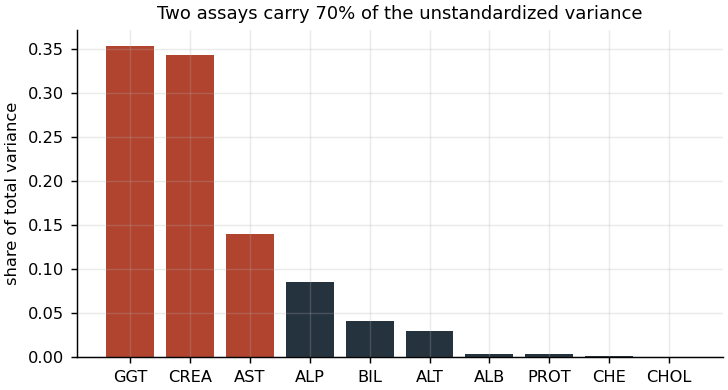
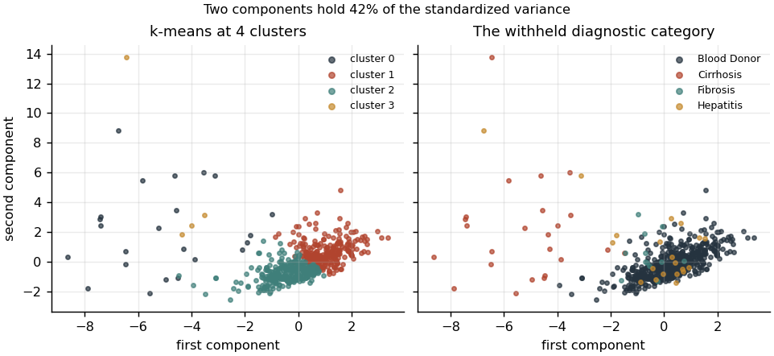
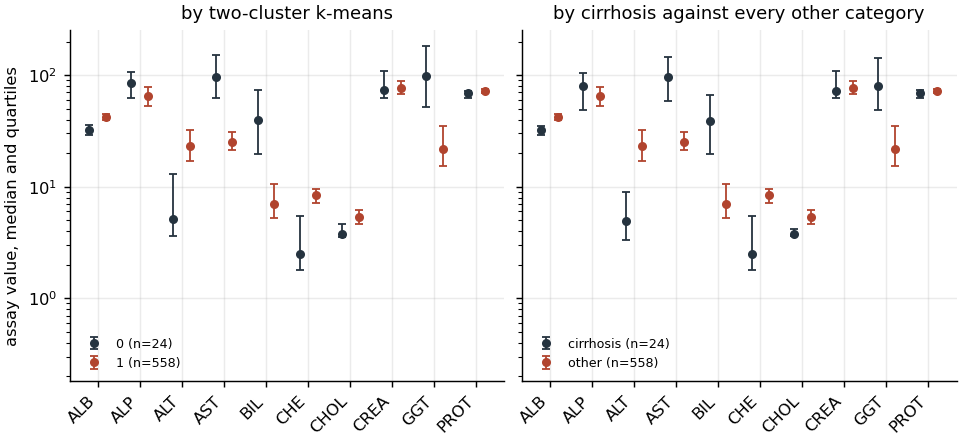

# Clustering: recovering hepatitis C categories without labels

## The question

The HCV data (Lichtinghagen et al. 2020) holds ten laboratory values for 615
subjects together with a diagnostic category for each: blood donor, hepatitis,
fibrosis or cirrhosis. The question is how much of that four-way structure the
laboratory values carry on their own. The labels are withheld from every
clustering and used only afterwards, to measure agreement.

The measurement is separated from the inference here deliberately. A cluster
index and a class index are arbitrary names, so a clustering cannot be scored by
comparing one to the other as a value. Four chance-corrected or renaming-invariant
measures are used instead: the adjusted Rand index (Hubert and Arabie 1985),
adjusted mutual information (Vinh et al. 2010), homogeneity and completeness.
Three internal indices are reported beside them, computed without any reference
to the labels.

## Preparation

Of the 615 released subjects, 7 carry the category `0s=suspect Blood Donor`,
which marks a donor whose values were questioned. Seven subjects will not
support a group of their own and they are not donors either, so they are removed
and counted. A further 26 subjects are missing at least one of the ten assays
and are removed as incomplete, leaving 582.

The removal is not spread evenly across the categories, and that matters for how
the agreement measures should be read.

| Category | Released | Analyzed |
|---|---|---|
| Blood donor | 533 | 526 |
| Hepatitis | 24 | 20 |
| Fibrosis | 21 | 12 |
| Cirrhosis | 30 | 24 |

The complete-case rule removes 43 percent of the fibrosis cases and 20 percent
of the cirrhosis cases against 1 percent of the donors. The three disease
categories that were already small are smaller still, and the class the analysis
is most interested in recovering is the one the rule cut hardest.

The release names gamma-glutamyl transferase `CGT`; the column is renamed `GGT`.

## Standardization, decided before the labels were consulted

The ten assays are measured on different scales and their unstandardized
variances differ by four orders of magnitude. Gamma-glutamyl transferase and
creatinine carry 69.7 percent of the total variance between them, so an
unstandardized Euclidean distance is very nearly the distance in those two
assays alone.

Both clusterings were computed. The unstandardized one agrees better with the
withheld labels, at an adjusted Rand index of 0.506 against 0.137, and it also
scores higher on Calinski-Harabasz, at 328.9 against 103.3. The standardized
version is used for every result reported below regardless, because the choice
between them was made on the scales and not on the agreement. Selecting the
preprocessing by how well the clusters match the withheld labels would put those
labels back into an analysis whose only claim is that it never saw them, and the
result would no longer measure what the assays carry unsupervised. Both numbers
are recorded, so a reader can see the size of what the decision cost.

## Three methods at four clusters

| Method | Clusters | Unassigned | Calinski-Harabasz | Silhouette | Davies-Bouldin | Adjusted Rand | Adjusted MI |
|---|---|---|---|---|---|---|---|
| k-means | 4 | 0 | 103.3 | 0.181 | 1.550 | 0.137 | 0.239 |
| DBSCAN, eps 3.6, min_samples 3 | 4 | 11 | 45.5 | 0.596 | 0.581 | 0.425 | 0.296 |
| Agglomerative, complete linkage | 4 | 0 | 66.9 | 0.650 | 0.708 | 0.379 | 0.299 |

The DBSCAN neighborhood parameters were searched over 36 values of eps and 6
minimum sample counts. A configuration was admitted only when it formed at least
two clusters and assigned at least four fifths of the subjects, because a run
that labels most points as outliers scores well on an internal index while
describing little of the data. Forty-six configurations formed two or more
clusters, and the best admitted one assigns 98.1 percent of subjects.

The table contains the finding that matters most in this analysis. Calinski-Harabasz,
the index the coursework selected its clustering by, ranks k-means first by a
factor of two. Agreement with the withheld labels ranks k-means last by a factor
of three. The index is a ratio of between-cluster to within-cluster dispersion,
which is the quantity k-means minimizes directly, so it is not a neutral judge
between k-means and a method optimizing anything else. Silhouette and
Davies-Bouldin both agree with the labels and disagree with Calinski-Harabasz
here, which is a reason to report more than one internal index whenever the
labels are genuinely unavailable.

The k-means contingency table shows where the four-cluster solution fails.

| Cluster | Blood donor | Hepatitis | Fibrosis | Cirrhosis |
|---|---|---|---|---|
| 0 | 0 | 4 | 1 | 18 |
| 1 | 235 | 9 | 3 | 0 |
| 2 | 291 | 7 | 8 | 2 |
| 3 | 0 | 0 | 0 | 4 |

Clusters 1 and 2 split the donors into two groups of comparable size and hold
almost nothing else, so two of the four available clusters are spent
partitioning the healthy majority. Cluster 0 is a cirrhosis group and cluster 3
is four more cirrhosis cases. Hepatitis and fibrosis are not recovered at all:
their 32 subjects are distributed across three clusters with no cluster holding a
majority of either. Homogeneity of 0.378 against completeness of 0.184 states
the same thing numerically. A cluster tends to hold one category, and a category
is spread across clusters.

The two components in that figure hold 42.0 percent of the standardized
variance, so the separations it shows are a projection and not the geometry the
clustering worked in.

## Where the recovery is strong

The coursework also compared a two-cluster solution against cirrhosis held apart
from every other category, and that comparison is the one that succeeds.

| Cluster | Every other category | Cirrhosis |
|---|---|---|
| 0 | 2 | 22 |
| 1 | 556 | 2 |

Two clusters, fitted with no reference to any label, recover cirrhosis against
everything else with an adjusted Rand index of 0.906, adjusted mutual
information of 0.797, and homogeneity and completeness both 0.799. Twenty-two of
the 24 cirrhosis cases fall in a cluster of 24. This solution also carries the
highest Calinski-Harabasz score of any k tested, 113.4, so on this dataset the
internal index does point at the right number of clusters even while it points
at the wrong method.

The two panels of that figure are close to identical, which is the same result
the contingency table gives. The release states no units for any assay, so the
values below are quoted as released. The 24-subject cluster carries median
albumin of 32.5 against 42.1, median bilirubin of 40.0 against 7.0, median
cholinesterase of 2.49 against 8.38, and median gamma-glutamyl transferase of
97.4 against 22.0. Low albumin, low cholinesterase and raised bilirubin together
describe failing synthetic liver function, and that is a large enough
displacement in ten dimensions for an unsupervised method to find it.

## What this establishes, and what it does not

Cirrhosis is separable from a routine laboratory panel without labels. The
intermediate stages are not. Hepatitis and fibrosis differ from healthy donors
by less than the spread among donors themselves, so a distance-based method
partitions the donors before it isolates either disease group.

## Limitations

The categories are not balanced and the imbalance decides the outcome. 526 of
582 subjects are donors, so a method minimizing within-cluster dispersion spends
its clusters where the points are. Any four-cluster comparison against these
labels is measuring a method's willingness to form a cluster of twenty against
a background of five hundred.

The 32 hepatitis and fibrosis subjects that survive cleaning are too few to
support a claim in either direction about whether those stages are separable in
principle. What is established is that they are not separable at this sample
size by these three methods.

The DBSCAN parameters were selected by an internal index on the same data the
clustering was scored on, which is standard practice for an unsupervised method
with no held-out partition and is still selection on the evaluation data. Its
reported indices are therefore the best of 46 configurations and not an
out-of-sample estimate. The k-means and agglomerative results take no such
selection, having only the fixed cluster count.

Complete linkage produces a single-subject cluster at every k from 2 to 6, so
the agglomerative agreement of 0.379 is achieved with one of its four clusters
holding one point. The linkage was kept because it is the one the coursework
specified; a different linkage would be a different comparison.

The four categories are a staging of one disease and not four unrelated
conditions, so they are ordered. Every measure used here treats them as
unordered, which discards the information that a fibrosis case misassigned to
cirrhosis is a smaller error than one misassigned to donor.
