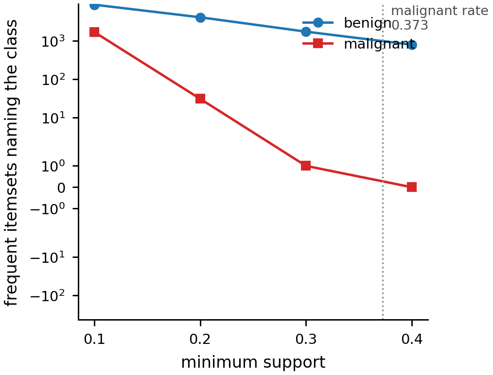
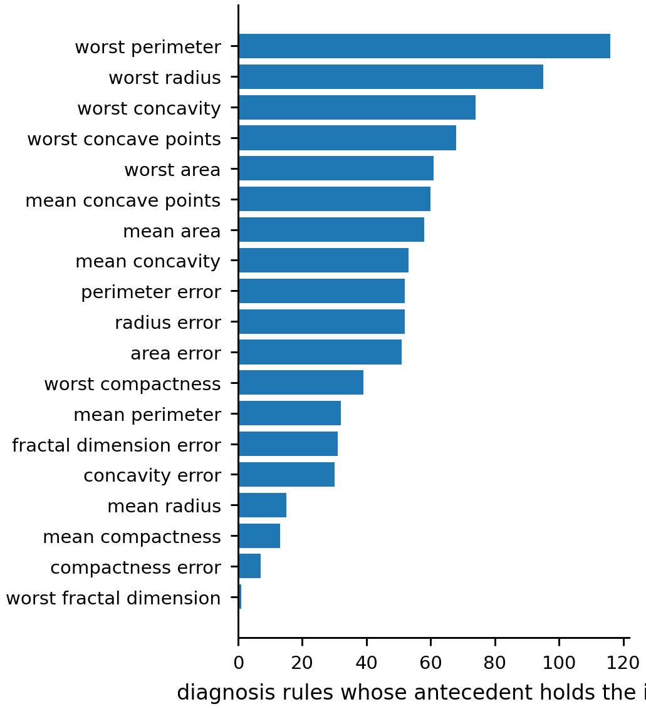

# Association rules: co-occurring diagnostic features

## The question

The Wisconsin diagnostic breast cancer data (Wolberg et al. 1995) holds thirty
continuous features computed from digitized images of fine needle aspirates,
and a malignant or benign diagnosis for each of 569 samples. The features are
the mean, standard error and largest value of ten cell nucleus measurements
(Street et al. 1993). The question is which measurements co-occur, and whether
any co-occurrence carries the diagnosis.

Association rule mining answers the first part of that directly and the second
part only by a filtering step whose nature should be named. Apriori (Agrawal et
al. 1993) is unsupervised. It receives 92 items with no distinguished one among
them and returns every frequent combination. Selecting the returned rules whose
consequent is the diagnosis produces a ranking of features by their association
with the outcome, which is a feature selection result. Both are reported here,
under their own names.

## Preparation

Apriori needs items, so every one of the thirty continuous features is
discretized into three levels and one-hot encoded. The level boundaries are
placed by one-dimensional k-means on each feature separately, so a boundary
follows the density of that feature and is not a fixed quantile. The boundaries
are recorded in `results/m03_bin_edges.csv`, because a rule naming level 0 of
mean radius means nothing without the interval that level covers: for mean
radius it is 6.98 to 12.90, against 12.90 to 17.30 and 17.30 to 28.11.

The diagnosis joins each transaction as two further items, giving 92 items over
569 transactions. Itemsets were bounded at length 4. The coursework left the
length unbounded and returned tens of thousands of frequent itemsets and
hundreds of thousands of rules, most of them longer restatements of shorter
ones: an itemset of ten pairwise associated items appears alongside every one of
its subsets. The bound is a presentation choice and it is recorded in
`results/metrics.csv` as `m03.max_itemset_length`.

## The support threshold decides which class can be found

The coursework mined at a minimum support of 0.4. No itemset can be more
frequent than its rarest item, and the malignant rate in this data is 0.3726.
Every itemset containing the malignant item therefore has support at most
0.3726, which is below the threshold, so at a support of 0.4 the malignant class
cannot appear in a frequent itemset at all. Of the 3,653 frequent itemsets found
at that threshold, 792 name the benign diagnosis and none name the malignant
one.

| Minimum support | Frequent itemsets | Naming malignant | Naming benign |
|---|---|---|---|
| 0.4 | 3,653 | 0 | 792 |
| 0.3 | 9,886 | 1 | 1,735 |
| 0.2 | 27,045 | 31 | 4,104 |
| 0.1 | 80,058 | 1,699 | 8,716 |

Every diagnosis rule the coursework reported was a rule about benign samples,
and that was a consequence of the threshold and not of the data. The threshold
of 0.4 is kept here so the run is comparable, and the sweep is reported beside
it so the constraint is visible. A threshold below 0.3726 is required before
malignancy can be described at all, and a threshold near 0.1 is required before
enough malignant itemsets exist to rank.

## Result

At a minimum support of 0.4 and a minimum conviction of 10, Apriori returns
3,653 frequent itemsets and 5,972 rules. Of those rules, 321 name a diagnosis
as their only consequent, and all 321 name the benign one.

| Itemset length | Itemsets |
|---|---|
| 1 | 34 |
| 2 | 226 |
| 3 | 937 |
| 4 | 2,456 |

The strongest rules are close to the ceiling the class rate imposes. The benign
rate is 0.6274, so a rule with the benign diagnosis as its consequent cannot
exceed a lift of 1 / 0.6274 = 1.594. The best rule observed reaches 1.588 at a
confidence of 0.9965: of the 283 samples that are simultaneously in the lowest
level of mean concave points, of radius error and of worst perimeter, 282 are
benign.

| Antecedent | Support | Confidence | Lift | Conviction |
|---|---|---|---|---|
| mean concave points_0, radius error_0, worst perimeter_0 | 0.496 | 0.9965 | 1.588 | 105.4 |
| mean concave points_0, perimeter error_0, worst perimeter_0 | 0.494 | 0.9965 | 1.588 | 105.1 |
| mean concave points_0, radius error_0, worst radius_0 | 0.480 | 0.9964 | 1.588 | 102.1 |

The median confidence across all 321 diagnosis rules is 0.980. The finding is
that the lowest level of the size and irregularity measurements co-occurs with a
benign diagnosis almost without exception, and that this holds for half the
samples in the dataset. The converse does not follow and is not established: a
sample in a higher level is not thereby malignant, and the mining run at this
threshold cannot speak to that at all.

## The feature selection reading

Nineteen items appear in the antecedents of the 321 diagnosis rules, drawn from
19 distinct features of the 30.

Every one of the 19 is the lowest level of its feature. Not one rule is built
from a middle or top level, which follows from the support threshold. An item
must itself hold in at least 40 percent of samples to enter a frequent itemset,
and for these features the lowest level is the only one of the three that is
that common.

The 19 are the size and boundary shape measurements. Radius, perimeter, area,
concavity and compactness each appear in all three of their released forms, the
mean, the standard error and the largest value. Worst perimeter leads with 116
rules and worst radius follows with 95. The 11 features absent from every rule
are the three forms each of texture, smoothness and symmetry, together with mean
fractal dimension and the standard error of concave points. Mining recovers,
with no supervision and no distinguished target item, that nucleus size and
boundary irregularity separate the diagnoses while texture, smoothness and
symmetry do not.

## What rule mining establishes that a classifier would not

A classifier trained on these features separates malignant from benign with a
cross-validated accuracy above 0.95 in the report that released them (Street
et al. 1993), and nothing here competes with that. What the rules add is a
different kind of statement. A
classifier's output is a boundary in thirty dimensions that no reader can
inspect; a rule is a conjunction of three named conditions and a count. The
rule "lowest level of mean concave points, of radius error and of worst
perimeter" holds for 283 samples and 282 of them are benign, and that sentence
can be checked against the released data by anyone with the table. The price is
that the rules describe only the region of the feature space where items are
common enough to clear the support threshold, which here is the benign half,
and say nothing about the rest.

The 19 items the rules select are also a feature selection that used no label
in its mining step. It arrived at size and boundary irregularity by counting
co-occurrences, with the diagnosis present as two items among 92 and given no
special standing. That is the one thing an unsupervised pass over labeled data
can establish that a supervised pass cannot: whether the structure the label
names is also structure the features hold on their own, before any model is
fitted to the label.

## Limitations

Discretization discards the ordering inside each feature and all information
about the position of a value within its level. Three levels chosen by k-means
on the marginal distribution of one feature is a coarse summary of a continuous
measurement, and a rule cannot express a monotone relationship at all.

The thirty features are strongly correlated by construction: radius, perimeter
and area are three functions of one geometry, and the mean, standard error and
largest value of each are three summaries of one image. Rules that differ only
by exchanging one of these for another are not independent findings. The top
rules in the table above show exactly that substitution, which is why the
support and confidence of the first three are nearly identical.

Support and confidence are computed on all 569 samples with no held-out
partition, so the confidence figures describe the data mined and are not
estimates of out-of-sample precision. Association rule mining has no training
and test split in its standard form, and the rules reported here should be read
as a description of this dataset.

Conviction at a threshold of 10 is a strict filter and its scale is not
intuitive: a conviction of 105 means the rule fails 105 times less often than
independence would predict. Ranking the surviving rules by lift is a second
choice, and a different metric would return a different ordering of the same
rule set.

The 321 diagnosis rules describe the benign class only, for the reason given
above. Nothing here is a finding about malignancy.
