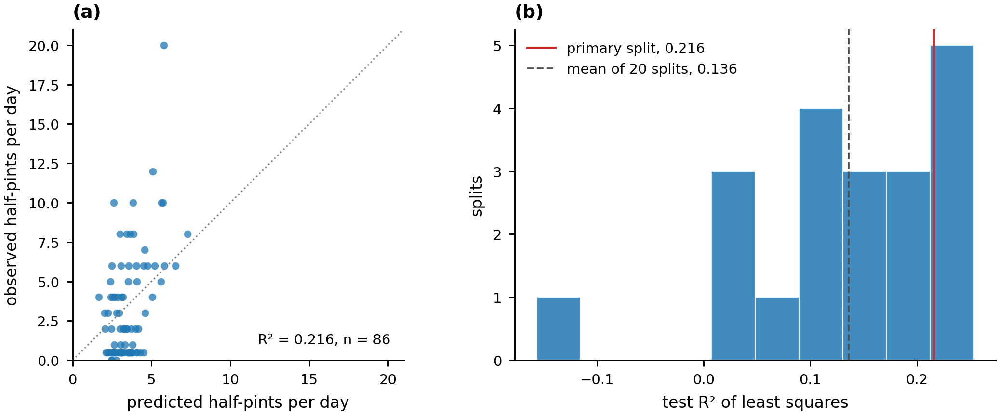
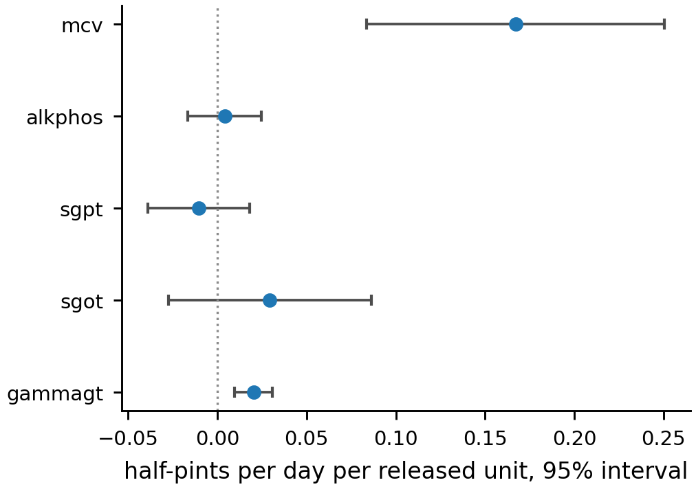

# Regression: daily alcohol intake from a liver enzyme panel

## The question and the trap

The BUPA liver disorders data (Forsyth 1990) records five blood tests and one
behavioral measurement for 345 male subjects. The tests are mean corpuscular
volume, alkaline phosphatase, alanine aminotransferase, aspartate
aminotransferase and gamma-glutamyl transpeptidase. The behavioral measurement,
`drinks`, is the number of half-pint equivalents of alcoholic beverage drunk per
day. The analysis estimates `drinks` from the five tests.

The dataset carries a documented trap in its seventh column. The UCI record
states that the field, `selector`, "has been widely misinterpreted in the past
as a dependent variable representing presence or absence of a liver disorder",
that this reading is incorrect, and that BUPA created the field as a train and
test selector. The record adds that the data holds no variable representing
presence or absence of a liver disorder at all. Its variables table gives
`selector` the role of other and `drinks` the role of target, and lists the
associated task as regression. McDermott and Forsyth (2016), the second of
whom donated the data, traced the misreading through the published literature
and found that most of the several hundred papers using the data as a
classification benchmark had used the split flag as the class.

The coursework this analysis rebuilds treated the data as a clustering problem
and clustered the first six columns together, which places the outcome inside
the feature space. This rebuild drops `selector` in `src/data.load_bupa` and
predicts `drinks` from the five tests. Gate 02 checks three things separately:
that the released file does still carry `selector`, that the cleaned table does
not, and that the column is neither a predictor nor the target. The first of
those checks is what makes the other two able to fail.

## Preparation

The release holds four rows identical in all seven columns. Those are collapsed
before the split, leaving 341 subjects. A duplicated row left in place would sit
on both sides of a partition while the index partition stayed disjoint, so the
overlap check in `src/splits.report` compares row content and not position. The
partition is 255 subjects for training and 86 for testing, a test share of
0.2522, with no row common to both sides. Nine subjects report zero drinks per
day.

## Result

Three models were fitted on the same partition so that a weak result could be
attributed to its cause.

| Model | Test R² | Test RMSE | Test MAE | Five-fold R² on training |
|---|---|---|---|---|
| Least squares | 0.216 | 3.099 | 2.458 | 0.058 ± 0.093 |
| Least squares on log(1 + drinks) | 0.153 | 3.221 | 2.322 | — |
| Random forest | 0.235 | 3.061 | 2.391 | 0.118 ± 0.107 |

The panel does carry signal. The least squares fit on the training partition
gives F = 10.07 on 5 and 249 degrees of freedom, p = 8.6 × 10⁻⁹, so the five
tests jointly relate to reported intake. The amount they explain is small, and
the single held-out estimate of 0.216 is the most favorable number in the table
and the least reliable one. Five-fold cross-validation inside the training
partition gives 0.058 with a standard deviation of 0.093 across folds.

The split itself was then redrawn twenty times, the primary seed first, and
least squares was refitted and scored on each draw. The held-out R² has a mean
of 0.136 and a standard deviation of 0.098 over the twenty draws, and ranges
from −0.157 to 0.253. The primary draw, at 0.216, is the fifth highest of the
twenty. A single partition of 341 rows into 255 and 86 is one draw from a
distribution whose width is comparable to its center. The number to carry away
is the mean of 0.14 with a standard error near 0.1, and not the 0.22 the
primary split happened to produce.

Two of the five tests carry the relationship.

| Term | Estimate | 95 percent interval | p |
|---|---|---|---|
| mean corpuscular volume | 0.1670 | 0.0834 to 0.2506 | 1.1 × 10⁻⁴ |
| gamma-glutamyl transpeptidase | 0.0202 | 0.0095 to 0.0310 | 2.6 × 10⁻⁴ |
| aspartate aminotransferase | 0.0293 | −0.0276 to 0.0863 | 0.311 |
| alanine aminotransferase | −0.0105 | −0.0390 to 0.0181 | 0.472 |
| alkaline phosphatase | 0.0040 | −0.0167 to 0.0248 | 0.703 |

The release states no units for the five assays, so each coefficient is read
per released unit. A one unit rise in mean corpuscular volume corresponds to
0.167 more half-pints per day, and a one unit rise in gamma-glutamyl
transpeptidase to 0.020 more. Both intervals exclude zero and both signs are positive, which
matches what the two assays are used for clinically: red cell volume rises under
sustained alcohol intake, and gamma-glutamyl transpeptidase is the standard
enzyme marker of it. The three remaining intervals all contain zero, and the
widest of them, for aspartate aminotransferase, rules out an effect larger than
0.086 half-pints per day per unit. The random forest ranks the same two assays
first and second by permutation importance, at 0.271 for gamma-glutamyl
transpeptidase and 0.226 for mean corpuscular volume, so the ranking does not
depend on the linear form.

## What the comparison of the three models establishes

The log-transformed fit scores worse on the held-out subjects than the untransformed
one, 0.153 against 0.216, so the skew of the target is not the binding constraint.
The random forest is ahead of least squares on both the single split and the
cross-validated estimate, 0.118 against 0.058, which leaves room for some
curvature or interaction, and the gap is well inside the fold-to-fold spread of
either estimate. Neither alternative changes the conclusion. Five blood tests
predict self-reported daily drinking weakly, and the ceiling is a property of
the data.

## Limitations

The residuals are not normal. Jarque-Bera gives 113.1 with p = 2.8 × 10⁻²⁵ and a
skew of 1.14, so the confidence intervals above, which assume normal errors, are
narrower than the true sampling uncertainty. The point estimates do not depend
on that assumption.

The target is self-reported and has no stated reference period, so it carries
both recall error and a plausible downward bias. Its resolution is coarse. The
345 released subjects take only 16 distinct values between 0 and 20, at 0, 0.5
and then whole numbers, thinning to 12, 15, 16 and 20 at the top. Nine of the
341 analyzed subjects report zero. A model of a self-report is not a model of
consumption.

Every subject in the release is male, which the UCI record states explicitly.
Nothing here transfers to women without new data.

The design is cross-sectional and observational. A coefficient reads as the
difference in reported intake associated with a difference in an assay, and not
as the effect of drinking on that assay, although the causal direction in this
system is known independently to run from intake to enzyme level.

The predictors are collinear. The design matrix has a condition number of 2578,
and alanine and aspartate aminotransferase are measured on overlapping
processes, so their individual coefficients are less stable than the joint fit.
The joint F test and the two significant terms are the parts of the fit to
quote.

The dataset is small for a five-predictor model. The gap between the
in-sample R² of 0.168 and the cross-validated 0.058 is the size of the optimism
that fitting and evaluating on the same 255 rows produces. The twenty redrawn
splits show that the held-out figure from any one partition can land anywhere
from below zero to a quarter. One of the twenty draws gives a negative
R², which means that on that draw the panel predicted intake worse than the
training mean would have.
